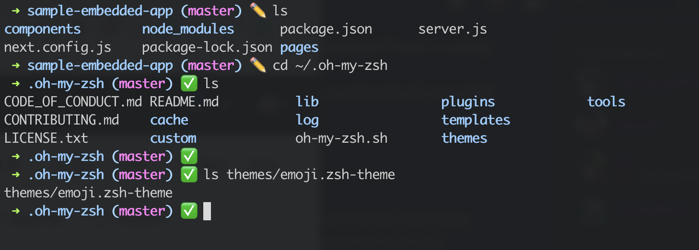

# ✏️✅ emoji theme for oh my zsh

[emoji theme](https://github.com/ohmyzsh/ohmyzsh/wiki/External-themes) for [oh-my-zsh](https://github.com/ohmyzsh/ohmyzsh/). simplified *robbyrussell* and replaced git prompt symbol with emoji for better clarity



## Installation

Copy emoji.zsh-theme into your ```~/.oh-my-zsh/themes/``` directory

Then change current theme to emoji ```ZSH_THEME=emoji``` in your ```~/.zshrc```.

Activate a new theme with  ```$ source ~/.zshrc```.

## Syntax
- ```➜ current_dir (git_branch) <emoji indicator>```
- ✏️ Git prompt is dirty (uncommitted files)
- ✅ Git prompt is clean (committed)
